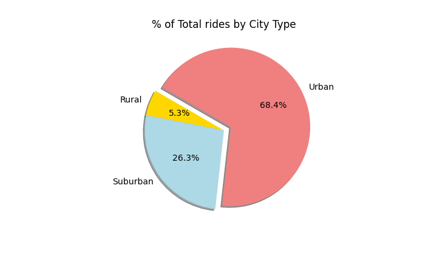
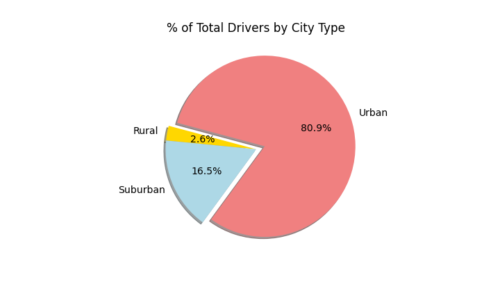
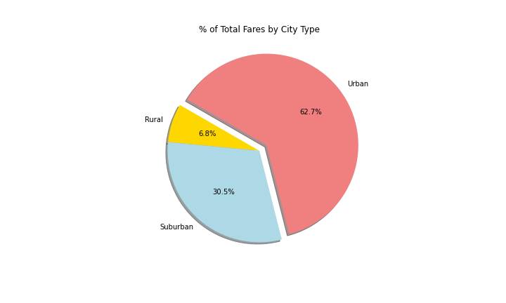
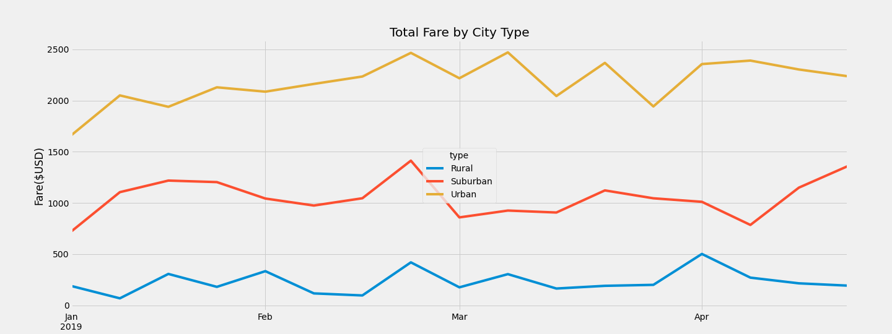

# PyBer_Analysis

## Overview
the following report was created for Pyber,  a ride-sharing app company valued at aproximately $2.3 billion dollars.

### Purpose
Using Python, Pandas and Matplotlib, we were tasked to create multiple graphs and charts illustrating the following:
- Total Rides per Area Type
- Total Drivers per Area Type
- Total Fares per Area Type
- Average Fare per Rider per Area Type
- Average Fare per Driver per Area Type
- Total Fares by City Type

In addition a written report summarizing the data as well written recomendations for future business developement were requested.
All data is based on data recieved between January 2019 and late April 2019.  Driving areas were broken down into 3 categories: Rural, Suburban, and urban areas.

### Resources
- Data Source: city_data.csv, ride_data.csv
- Software:
 - Python 3.7.7
 - Pandas
 - Matplotlib

## Results of Analyis

### Fig 1: PyBer Ride Summary DataFrame

### Total Rides per Area Type
(See fig 1, above)

Between the the months of January 2019 and April 2019, total rides were distributed as follows:
- Rural: 125
- Suburban: 625
- Urban: 1,625

As seen in the chart below, urban areas made up 68.4% of total rides during this time period, with Suburban areas making up 26.3% and Rural areas at 5.3% of total rides.
#### % of Total Rides by City Type

### Total Drivers per Area Type
(See fig 1, above)

Between the the months of January 2019 and April 2019, total number of drivers were distributed as follows:
- Rural: 78
- Suburban: 490
- Urban: 2,405

As seen in the chart below, Urban areas made up 80.9% of total number of drivers during this time period, with Suburban area making up 16.5% and Rural areas at 2.6% of total number of drivers.
#### % of Total Drivers by City Type
)

### Total Fares per Area Type
(See fig 1, above)

Between the the months of January 2019 and April 2019, total amount of fares were distributed as follows:
- Rural:  $4,327.93
- Suburban: $19,356.33
- Urban: $39,854,38

As seen in the chart below, Urban areas made up 62.7% of total amount of fares during this time period, with Suburban areas making up 30.5% and Rural areas at 6.8% of total number of drivers.
#### % of Total Fares by City Type

### Average Fare per Rider per Area Type
(See fig 1, above)

Between the the months of January 2019 and April 2019, the average fares per rider were distributed as follows:
- Rural:  $34.62
- Suburban: $30.97
- Urban: $24.53

The average fares per rider for Rural areas was 38.4% of the total fares per rider fares during this time period, with Suburban areas making up 34.3% and urban areas at 27.2% of total number of drivers.

### Average Fare per Driver per Area Type
(See fig 1, above)

Between the the months of January 2019 and April 2019, the average fares per driver were distributed as follows:
- Rural:  $55.49
- Suburban: $39.50
- Urban: $16.57

The average fares per rider for Rural areas was 49.7% of the total fares per rider fares during this time period, with Suburban areas making up 35.4% and urban areas at 14.8% of total number of drivers.

### Total Fares per Type per Week
#### Graph:  Total Fare by City Type

## Summary
  Based solely on the graph "Total Fares per Type Per Week" there does not appear to be any forseeable trends.  There are peaks and valleys, but no discernable trends based on time.  However when the Pyber Ride Summary DataFrame (Fig 1) is analysed there are noticable trends. Total rides, total drivers and total fares are consistantly and substantially higher for urban areas.  Using the data provided, this is easily explained.  Urban areas have substantily larger populations as compared to suburban and rural areas, therefore it is logical to assume that the more people living in a designated area, the more people there are utilizing PyBer.
  
  The average fare per driver and average fare per rider at first glance may seem confusing.  Based on the data, the average fares per rider and driver are substantially higher for Rural areas, especially when compared to the data points in  Urban areas.  Although the data was not provided for this report, it can be safely inferred that the higher rates in Rural areas are based on the average distances between a rider's starting location and destination.   In Rural areas, there are, on average, much greater distances between locations than you would find in a suburban or urban setting.  For example, in a Suburban or Urban area, you are far more likely to have several supermarkets within a  small geographical area, whereas in a Rural area, there maybe one supermarket within a 10 mile radius.
  
### Business Reommendations
 .1 Further analysis including data based on peak usage times. 
 - This will give a much clearer picture if there are real trends based on time of usage. This would have the   further benefit of showing if there is a substantial drop in  riders during these peak time periods.
 
 .2 Lower the rates for rural areas.  
 - Since riders are having to pay higher fares incured by the greater distances between destinations, lowering the rates per minute should encourage more usage of Pyber by those living in rural areas.
 
 .3 Decrease the number of drivers in Urban areas.
 - This will insure that our drivers in urban area are able to make rates that keep them satisfied with their income.  Satisfied employees produce satisfied customers.
